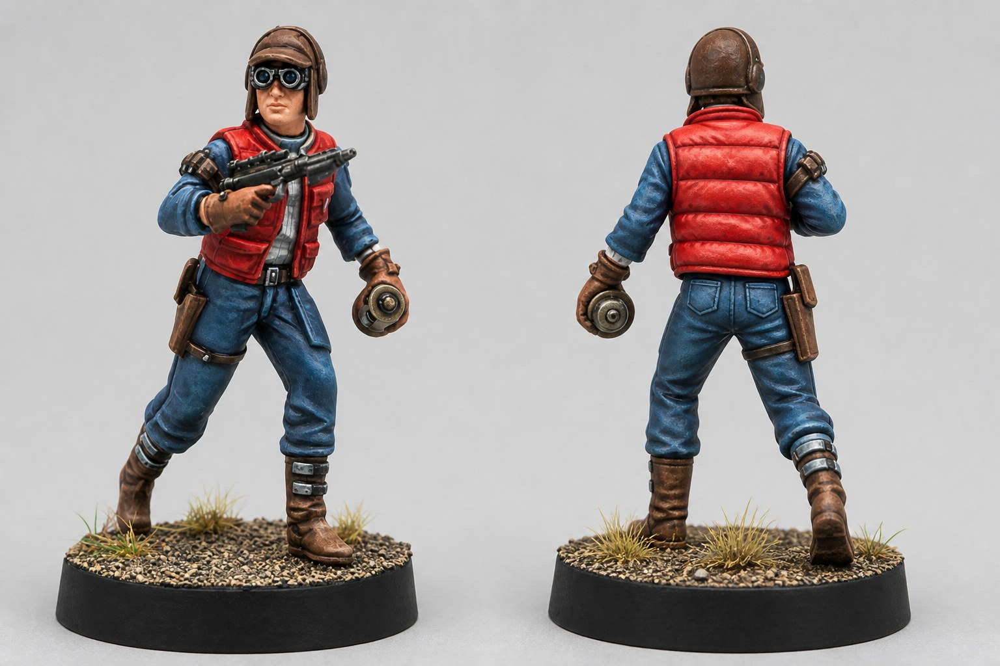

- **Style recherché :** Marty McFly en 1985, adapté à l'équipement de la Sleeper Cell
- **Couleurs dominantes :** rouge vif et denim bleu
- **Couleurs d'accent :** blanc cassé, cuir brun et reflets froids sur les lunettes
- **Niveau de difficulté :** intermédiaire
- **Temps estimé :** 4 à 6 heures

Le rouge chaud attire immédiatement le regard, tandis que le denim désaturé donne une masse froide suffisamment claire pour séparer les vêtements. Le blanc cassé reste limité à la chemise et aux détails afin de renforcer la ressemblance sans concurrencer le visage.

## 1. Bases

Travaille sur une sous-couche claire. Dilue chaque base avec environ 1 part d'eau et applique deux couches fines en laissant sécher la première avant la seconde.

### Doudoune rouge

- **72.012 Scarlet Red**

Pose **72.012 Scarlet Red** sur le gilet matelassé. Garde les manches bleues : c'est cette séparation qui fera lire la silhouette de Marty à distance de jeu.

### Veste et pantalon en denim

- 2 parts de **70.898 Dark Sea Blue**
- 1 part de **72.047 Wolf Grey**

Mélange les deux peintures et applique-les sur les manches et le pantalon. Dilue avec 1 part d'eau et passe deux couches fines.

### Chemise et détails blancs

- 2 parts de **72.101 Off-White**
- 1 part de **72.047 Wolf Grey**

Mélange les deux peintures et peins la chemise visible au col et sous le gilet, puis les lacets et les bandes des chaussures. Deux couches fines suffisent généralement.

### Cuirs, bottes et casque

- **72.045 Charred Brown**
- **72.043 Beasty Brown**

Peins le holster, les sangles, les gants et les bottes avec **72.045 Charred Brown**. Utilise **72.043 Beasty Brown** pour le casque, puis **72.045 Charred Brown** pour les cheveux visibles.

### Visage

- **72.107 Athena Skin**

Pose deux couches fines de **72.107 Athena Skin**. Évite de charger les yeux et la jonction entre le visage et les lunettes.

### Arme, lunettes et dispositif

- 2 parts de **72.054 Gunmetal Metal**
- 1 part de **72.051 Black**
- **70.898 Dark Sea Blue**
- **72.058 Brassy Brass**

Utilise le mélange métallique indiqué dans la liste sur l'arme et les parties métalliques du dispositif. Dilue avec 1 part d'eau et applique deux couches fines.

Peins la monture des lunettes avec **72.051 Black**, les verres avec **70.898 Dark Sea Blue**, les boucles avec **72.054 Gunmetal Metal** et l'anneau du dispositif avec **72.058 Brassy Brass**.

## 2. Ombrage

### Doudoune rouge

- 2 parts de **72.011 Gory Red**
- 1 part de **72.115 Grunge Brown**

Dilution : 2 parts d'eau.

Mélange les deux peintures et dépose-les dans les creux entre les boudins, sous les bras et le long du bas du gilet. Fais deux passages contrôlés plutôt qu'un lavis abondant.

### Denim

- **73.207 Wash Blue**

Passe **73.207 Wash Blue** dans les plis du pantalon, sous les genoux et sous les bras. Essuie ton pinceau avant de toucher la figurine pour éviter les auréoles sur les grandes surfaces.

### Chemise blanche

- **Citadel Soulblight Grey**

Applique **Citadel Soulblight Grey** uniquement dans les plis et autour du col. Si le lavis déborde, reprends immédiatement la zone avec le mélange de base encore humide sur la palette.

### Cuirs et casque

- **Citadel Agrax Earthshade**

Pose **Citadel Agrax Earthshade** dans les coutures du holster, autour des sangles et dans les plis des bottes. Utilise le même lavis sur le casque, sans remplir les surfaces planes.

### Visage

- **Citadel Reikland Fleshshade**

Dépose **Citadel Reikland Fleshshade** autour du nez, sous les pommettes, sous la lèvre et au contact des lunettes. Laisse sécher complètement avant de reprendre la peau.

### Métaux

- **Citadel Nuln Oil**

Ombrage l'arme, les boucles et le dispositif avec **Citadel Nuln Oil**. Oriente la figurine vers le bas pendant quelques secondes pour empêcher le lavis de revenir sur les manches.

## 3. Éclaircissements

### Doudoune rouge

- 2 parts de **72.012 Scarlet Red**
- 1 part de **72.010 Bloody Red**

Reprends les volumes avec **72.012 Scarlet Red**, en laissant l'ombre visible dans les séparations.

Mélange ensuite les deux peintures et dilue avec 1 part d'eau. Trace des lignes courtes sur le sommet des boudins, les épaules et les arêtes du col. Une seule couche précise suffit.

### Denim : reprise des plis

- 2 parts de **70.898 Dark Sea Blue**
- 1 part de **72.047 Wolf Grey**

Mélange les deux peintures et reprends les plis exposés.

### Denim : lumière

- 2 parts de **72.047 Wolf Grey**
- 1 part de **72.020 Imperial Blue**

Mélange les deux peintures et dilue avec 1 part d'eau. Pose des traits fins sur les genoux, le haut des cuisses, les coudes et les coutures. Garde les lumières plus courtes que les ombres pour conserver l'aspect denim sombre.

### Chemise et chaussures

- **72.101 Off-White**
- **70.993 White Grey**

Éclaircis les plis avec **72.101 Off-White**, puis place quelques points de **70.993 White Grey** sur le col, les lacets et les bandes les plus exposées.

### Cuirs, bottes et casque

- **72.043 Beasty Brown**
- **72.063 Desert Yellow**

Trace les arêtes avec **72.043 Beasty Brown**. Ajoute quelques marques fines de **72.063 Desert Yellow** sur le holster et les bottes pour simuler un cuir usé, sans éclaircir uniformément toutes les pièces.

### Visage

- 2 parts de **72.107 Athena Skin**
- 1 part de **72.003 Pale Flesh**

Reprends les volumes avec **72.107 Athena Skin**.

Mélange ensuite les deux peintures et dilue avec 1 part d'eau. Place cette lumière sur le nez, les pommettes, la lèvre inférieure et le menton.

### Métaux et lunettes

- **72.054 Gunmetal Metal**
- **71.064 Chrome (Metallic, gris très clair)**
- **72.021 Magic Blue**
- **72.095 Glacier Blue**

Repasse **72.054 Gunmetal Metal** sur les arêtes de l'arme et du dispositif, puis ajoute quelques points de **71.064 Chrome (Metallic, gris très clair)** sur les angles les plus exposés.

Trace un petit croissant de **72.021 Magic Blue** au bas de chaque verre, puis un point de **72.095 Glacier Blue** dans l'angle supérieur. Les deux verres doivent recevoir la lumière du même côté.

## 4. Finitions

### Motif de la chemise

- **70.898 Dark Sea Blue**

Avec un pinceau fin, trace quelques lignes verticales et horizontales très diluées de **70.898 Dark Sea Blue** sur la chemise. Limite le quadrillage aux zones bien visibles : à cette échelle, suggérer le motif est plus propre que chercher à reproduire chaque carreau.

### Usure et petits détails

- **72.010 Bloody Red**
- **72.011 Gory Red**
- **72.058 Brassy Brass**
- **71.064 Chrome (Metallic, gris très clair)**
- **72.051 Black**

Ajoute de rares éclats de **72.010 Bloody Red** sur les arêtes du gilet. Renforce les séparations les plus profondes avec **72.011 Gory Red** si elles ont disparu pendant les éclaircissements.

Place **72.058 Brassy Brass** sur le centre du dispositif et **71.064 Chrome (Metallic, gris très clair)** sur les boucles. Corrige enfin la monture des lunettes avec **72.051 Black**.

### Vernis

- **72.651 Matt Polyurethane Varnish**
- **69.701 Gloss Varnish**

Protège toute la figurine avec une couche fine de **72.651 Matt Polyurethane Varnish**. Après séchage complet, applique **69.701 Gloss Varnish** uniquement sur les verres des lunettes.

## 5. Socle

### Sol

- **72.062 Earth**
- **Citadel Agrax Earthshade**
- **72.063 Desert Yellow**
- **72.034 Bone White**

Peins le gravier déjà présent avec **72.062 Earth**, puis applique **Citadel Agrax Earthshade**. Après séchage, effectue un brossage à sec de **72.063 Desert Yellow**, suivi d'un brossage plus léger de **72.034 Bone White**.

### Pigments

- **73.121 Desert Dust**
- **73.103 Dark Yellow Ochre**

Dépose légèrement **73.121 Desert Dust** autour des bottes et dans les creux du gravier. Ajoute quelques touches de **73.103 Dark Yellow Ochre** près des touffes sèches pour varier la terre sans rendre le socle plus saturé que le gilet.

### Bord du socle

- **72.051 Black**

Termine avec deux couches fines de **72.051 Black** sur la tranche. Cette bordure nette isole les couleurs vives de la figurine du terrain.

**Résultat attendu**

Le gilet rouge forme le point focal principal, encadré par le denim froid. La chemise et les détails blanc cassé ramènent ensuite le regard vers le visage, tandis que les cuirs et le socle poussiéreux conservent l'ambiance commune de la Sleeper Cell.
