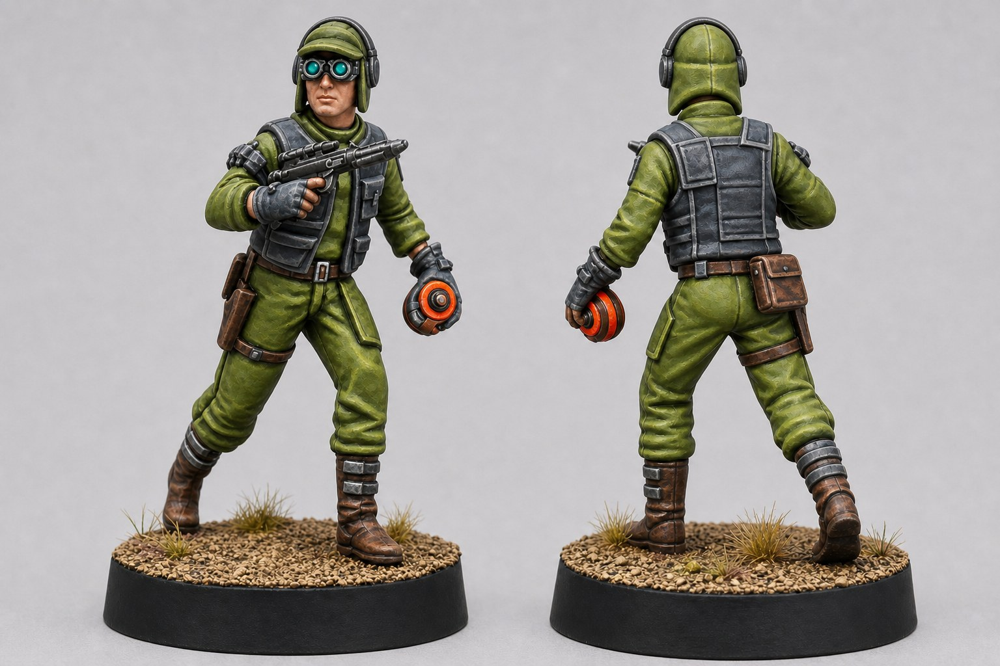

- **Style recherché :** commando lumineux et très contrasté, plus saturé que le schéma de référence
- **Couleurs dominantes :** olive lumineux et gris bleuté
- **Couleurs d'accent :** orange vif et cyan
- **Niveau de difficulté :** intermédiaire
- **Temps estimé :** 3 à 4 heures hors séchage

L'olive reste militaire, mais ses lumières jaunes-vertes lui donnent beaucoup plus d'énergie. Le gris bleuté sépare les protections du tissu, tandis que l'orange de la charge et le cyan des lunettes créent deux points focaux complémentaires.

## 1. Bases

Travaille en couches fines et laisse sécher chaque zone avant de toucher la suivante. Deux couches régulières donnent une meilleure base qu'une seule couche épaisse.

### Tenue olive lumineuse

Peins la veste, le pantalon, les manches et la coiffe avec le mélange suivant.

**Mélange (2:1)**

- 2 parts de **72.031 Camouflage Green**
- 1 part de **72.029 Sick Green**

Diluer avec 1 part d'eau et appliquer deux couches fines, en laissant sécher chaque couche.

### Gilet, genouillères et guêtres gris bleuté

Peins le gilet tactique, les renforts des épaules, les genouillères et les bandes autour de la jambe droite avec le mélange suivant.

**Mélange (2:1)**

- 2 parts de **72.155 Carbon Grey**
- 1 part de **72.047 Wolf Grey**

Diluer avec 1 part d'eau et appliquer deux couches fines, en laissant sécher chaque couche.

### Charge explosive orange

Applique **72.152 Heavy Orange** sur les anneaux et les panneaux colorés de la charge. Passe deux couches fines en gardant le centre et les parties mécaniques en gris sombre.

### Lentilles cyan

Peins les verres avec **70.898 Dark Sea Blue**, puis pose **72.024 Turquoise** sur leurs deux tiers inférieurs en laissant la base sombre visible en haut.

### Peau

Peins le visage et les mains avec **72.099 Skin Tone**, dilué avec un peu d'eau. Applique deux couches fines sans remplir les yeux ni les séparations entre les doigts.

### Cuirs et bottes

Pose **72.045 Charred Brown** sur les bottes, la ceinture, le holster et les sangles. Utilise **72.043 Beasty Brown** sur les pochettes pour les détacher légèrement du reste des cuirs.

### Arme et petits éléments métalliques

Peins le fusil avec **70.995 German Grey**, puis applique **72.054 Gunmetal Metal** sur le canon, le chargeur, la culasse et la boucle de ceinture. Garde la peinture métallique assez peu diluée pour éviter qu'elle coule sur les vêtements.

### Gants et casque audio

Applique **72.155 Carbon Grey** sur les gants, les écouteurs et leur arceau. Peins les coussinets et les creux avec **72.051 Black**.

## 2. Ombrage

L'objectif est de renforcer les volumes sans éteindre l'olive ni salir les accents vifs. Décharge toujours le pinceau avant de poser un lavis localisé.

### Tenue olive lumineuse

Dépose **Citadel Athonian Camoshade** dans les plis profonds, sous les bras, entre les jambes et sous la ceinture. Évite les grandes surfaces planes et retire immédiatement les auréoles avec un pinceau propre légèrement humide. Laisse sécher 30 minutes.

Renforce seulement les creux les plus profonds avec le mélange froid suivant. Il sépare les volumes sans ternir toute la tenue.

**Mélange (2:1)**

- 2 parts de **72.064 Cayman Green**
- 1 part de **70.898 Dark Sea Blue**

Diluer avec 2 parts d'eau et appliquer uniquement sous les bras, derrière les genoux et dans les plis les plus fermés.

### Gilet et protections

Applique **73.201 Wash Black** dans les coutures, sous les plaques du gilet et entre les bandes des guêtres. Ne recouvre pas toute la surface : la base grise doit rester visible.

### Orange et cyan

Utilise **72.011 Gory Red** très dilué dans les séparations de la charge. Tire la peinture vers les creux et laisse sécher avant de corriger les débordements avec **72.152 Heavy Orange**.

Renforce le haut des verres et le contour des montures avec **70.898 Dark Sea Blue**. Le dégradé doit rester sombre en haut et vif en bas.

### Peau

Prépare une ombre chaude pour le dessous du nez, les pommettes, les doigts et le contour des lunettes.

**Mélange (3:1)**

- 3 parts de **72.099 Skin Tone**
- 1 part de **72.045 Charred Brown**

Diluer avec 2 parts d'eau. Appliquer une couche fine uniquement dans les creux, puis laisser sécher complètement.

### Cuirs et bottes

Passe **Citadel Agrax Earthshade** sur les bottes, le holster, la ceinture et les pochettes. Guide le lavis vers les coutures et retire les flaques avant qu'elles ne sèchent.

### Arme, gants et casque audio

Applique **73.201 Wash Black** sur les parties métalliques du fusil. Utilise le même produit dans les articulations des gants et autour des écouteurs, sans recouvrir leurs surfaces supérieures.

## 3. Éclaircissements

Travaille avec le côté de la pointe du pinceau sur les arêtes. Les lumières doivent être plus franches sur le haut du corps et autour du visage.

### Tenue olive lumineuse

Reprends d'abord les plis exposés avec le mélange de base.

**Mélange (2:1)**

- 2 parts de **72.031 Camouflage Green**
- 1 part de **72.029 Sick Green**

Diluer avec 1 part d'eau et appliquer une couche fine sur les surfaces tournées vers le haut.

Pour les arêtes des manches, la coiffe et les plis supérieurs du pantalon, utilise une lumière plus jaune et plus saturée.

**Mélange (2:1)**

- 2 parts de **72.029 Sick Green**
- 1 part de **72.005 Moon Yellow**

Diluer avec 1 part d'eau. Tracer des lignes fines et interrompues, sans cerner tous les plis.

### Gilet, genouillères et guêtres gris bleuté

Trace les arêtes avec **72.047 Wolf Grey**, puis réserve **70.907 Pale Grey Blue** aux coins des plaques, aux boucles et aux bords supérieurs des bandes de jambe.

### Charge explosive orange

Réaffirme les surfaces tournées vers le haut avec **72.008 Orange Fire**. Ajoute ensuite de petits traits de lumière sur les anneaux de la charge.

**Mélange (2:1)**

- 2 parts de **72.008 Orange Fire**
- 1 part de **72.005 Moon Yellow**

Diluer avec 1 part d'eau et poser une seule couche fine sur les arêtes supérieures. L'orange doit rester concentré sur la charge : n'en ajoute pas aux sangles ni aux vêtements.

### Lentilles cyan

Pose **72.023 Electric Blue** sur la moitié inférieure de chaque verre, puis un trait plus petit de **72.095 Glacier Blue** dans le bas. Garde bien le haut sombre pour préserver le contraste.

### Peau

Reprends les joues, le front, le nez et le dessus des doigts avec **72.099 Skin Tone**. Pose ensuite quelques lumières plus petites avec **72.004 Elf Skin Tone**, surtout autour des lunettes et sur les phalanges.

### Cuirs et bottes

Éclaircis les bottes et le holster avec **72.043 Beasty Brown**. Sur les pochettes, les coutures et les arêtes les plus exposées, utilise **72.061 Khaki** par traits courts afin de suggérer un cuir usé.

### Arme, gants et casque audio

Passe **72.054 Gunmetal Metal** sur les arêtes du fusil, puis pose quelques points de **71.064 Chrome (Metallic, gris très clair)** sur la bouche du canon, le chargeur et les angles de la culasse.

Éclaircis les doigts des gants et le haut des écouteurs avec **70.993 White Grey**, en traits très fins.

## 4. Finitions

### Lunettes

Redessine proprement les montures avec **72.051 Black**. Dans chaque verre cyan, pose un trait fin de **72.001 Dead White** sur le bord inférieur et un point blanc dans l'angle supérieur. Ce contraste simple suffit à donner un reflet net à distance de jeu.

### Charge explosive

Renforce les séparations avec **72.011 Gory Red**, puis ajoute quelques éraflures avec **72.045 Charred Brown**.

Pour pousser la saturation sans écraser les éclaircissements, prépare ce glacis.

**Mélange (1:3)**

- 1 part de **72.156 Fluorescent Orange**
- 3 parts de **70.596 Glaze Medium**

Appliquer une couche très fine sur les surfaces orange tournées vers le haut, jamais dans les creux. Laisser sécher, puis replacer deux points de **72.005 Moon Yellow** sur les arêtes les plus hautes.

### Saturation de la tenue

Pour rendre l'olive plus « pétard », prépare un second glacis et réserve-le aux épaules, au dessus des manches, à la coiffe et aux genoux.

**Mélange (1:4)**

- 1 part de **72.104 Fluorescent Green**
- 4 parts de **70.596 Glaze Medium**

Appliquer une seule couche très fine. Si l'effet devient trop vert, reprendre immédiatement la zone avec le mélange de base encore humide.

### Visage

Peins les yeux avec **72.051 Black**, puis place un point minuscule de **72.101 Off-White** dans chacun. Si le regard devient trop grand, corrige le contour avec **72.099 Skin Tone** plutôt que d'ajouter davantage de noir.

### Usure contrôlée

Avec un morceau de mousse presque sec, tapote **72.155 Carbon Grey** sur le bas du gilet, les genouillères et les guêtres. Ajoute quelques points de **72.054 Gunmetal Metal** au centre des impacts les plus marqués. Reste léger pour conserver la saturation de la figurine.

### Protection

Une fois la figurine parfaitement sèche, applique **72.651 Matt Polyurethane Varnish** en couche fine. Après séchage, dépose **69.701 Gloss Varnish** uniquement sur les verres des lunettes.

## 5. Socle

### Terre ocre

Peins le sol avec **72.062 Earth**. Une fois sec, effectue un premier brossage avec **72.063 Desert Yellow**, puis un second plus léger avec **72.061 Khaki** sur les reliefs les plus hauts.

### Poussière

Dépose **73.103 Dark Yellow Ochre** autour des bottes et dans quelques creux du sol. Ajoute un voile plus léger de **73.121 Desert Dust** sur les reliefs. Fixe les pigments avec une très petite quantité d'eau déposée par capillarité, sans les brosser pendant le séchage.

### Bord du socle

Peins le bord avec **72.051 Black** en deux couches fines. Corrige la jonction avec le terrain pour obtenir une ligne propre.

Le résultat final doit être très lisible : une grande masse olive lumineuse, des protections froides, un visage chaud, puis deux accents distincts — cyan sur les lunettes et orange vif sur la charge. Le sol ocre soutient cette saturation et rattache le Saboteur au reste de la Sleeper Cell.

