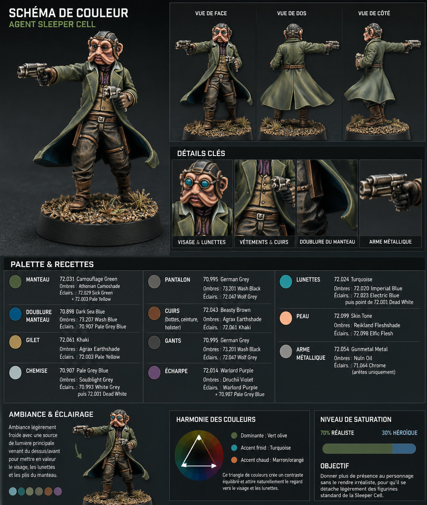

## 1. Bases

### Manteau

* Base : **72.031 Camouflage Green**

### Doublure du manteau

* Base : **70.898 Dark Sea Blue**

### Gilet

* Base : **72.061 Khaki**

### Chemise

* Base : **70.907 Pale Grey Blue**

### Écharpe

* Base : **72.014 Warlord Purple**

### Pantalon

* Base : **70.995 German Grey**

### Bottes

* Base : **72.043 Beasty Brown**

### Ceinture

* Base : **72.043 Beasty Brown**

### Holster

* Base : **72.043 Beasty Brown**

### Gants

* Base : **70.995 German Grey**

### Arme

* Base : **72.054 Gunmetal Metal**

### Monture des lunettes

* Base : **70.995 German Grey**

### Verres des lunettes

* Base : **72.024 Turquoise**

### Peau

* Base : **72.099 Skin Tone**

### Cheveux

* Base : **70.995 German Grey**

---

## 2. Ombrage

### Manteau

Lavis généreux de **Citadel Athonian Camoshade**.

Dans les plis les plus profonds, ajoute un mélange :

* **73.201 Wash Black**
* Athonian Camoshade (1:2)

---

### Doublure

Lavis de :

* **73.207 Wash Blue**

Accentuer les creux profonds avec une pointe de :

* **73.201 Wash Black**

---

### Gilet

Lavis de :

* **Citadel Agrax Earthshade**

---

### Chemise

Lavis léger :

* **Citadel Soulblight Grey**

---

### Écharpe

Lavis :

* **Citadel Druchii Violet**

---

### Cuirs

(Bottes, ceinture, holster)

Lavis :

* **Citadel Agrax Earthshade**

---

### Pantalon

Lavis :

* **73.201 Wash Black**

---

### Arme

Lavis :

* **Citadel Nuln Oil**

---

### Peau

Lavis :

* **Citadel Reikland Fleshshade**

---

## 3. Éclaircissements

Travaille en plusieurs passages dilués.

### Manteau

1. **72.031 Camouflage Green**
2. **72.031 Camouflage Green + 72.029 Sick Green (2:1)**
3. **72.029 Sick Green**
4. Derniers points de lumière :

**72.029 Sick Green + 72.003 Pale Yellow (2:1)**

Uniquement sur :

* épaules
* col
* bas du manteau
* arêtes des manches

---

### Doublure

1. **70.898 Dark Sea Blue**
2. **70.898 Dark Sea Blue + 70.907 Pale Grey Blue**
3. **70.907 Pale Grey Blue**

---

### Gilet

1. **72.061 Khaki**
2. **72.061 Khaki + 72.003 Pale Yellow**
3. Quelques points avec :

**72.003 Pale Yellow**

---

### Chemise

1. **70.907 Pale Grey Blue**

2. **70.993 White Grey**

3. Quelques touches de :

**72.001 Dead White**

sur les plis supérieurs.

---

### Écharpe

1. **72.014 Warlord Purple**

2. **72.014 Warlord Purple + 70.907 Pale Grey Blue**

---

### Pantalon

1. **70.995 German Grey**

2. **70.995 German Grey + 72.047 Wolf Grey**

3. **72.047 Wolf Grey**

Seulement sur les plis.

---

### Bottes et cuirs

1. **72.043 Beasty Brown**

2. **72.043 Beasty Brown + 72.061 Khaki**

Faire ressortir :

* les coutures
* les sangles
* les arrêtes des bottes

---

### Arme

Brossage très léger :

**72.054 Gunmetal Metal**

Puis lining des arêtes avec :

**71.064 Chrome**

---

### Lunettes

Reprendre :

* **72.024 Turquoise**

Puis ajouter dans le tiers inférieur :

* **72.023 Electric Blue**

Ajouter ensuite un petit reflet :

* **72.001 Dead White**

dans un angle.

---

### Peau

1. **72.099 Skin Tone**

2. **72.098 Elfic Flesh**

3. Mélange :

* **72.098 Elfic Flesh**
* **72.001 Dead White** (4:1)

uniquement sur :

* nez
* pommettes
* menton
* oreilles
* doigts

---

### Cheveux

Éclaircir légèrement avec :

* **72.047 Wolf Grey**

---

## 4. Dernières finitions

### OSL très discret des lunettes

Préparer un glaze :

* **72.024 Turquoise**
* **70.596 Glaze Medium**

Appliquer très légèrement autour des verres pour simuler leur éclat.

---

### Usure du manteau

Avec un pinceau fin :

* **72.029 Sick Green**
* puis quelques points de **72.003 Pale Yellow**

sur les arêtes.

---

### Cuir

Ajouter quelques micro-rayures avec :

**72.061 Khaki**

---

### Métal

Ajouter quelques éclats :

* **71.064 Chrome**

sur :

* canon
* chien
* arrêtes

---

### Vernis

Une fois la figurine terminée :

* **72.651 Matt Polyurethane Varnish**

Les verres des lunettes peuvent ensuite recevoir une pointe de :

* **69.701 Gloss Varnish**

pour leur donner un aspect vitré.

---

## 5. Socle

Comme le reste de ton escouade Sleeper Cell.

#### Sol

Texture sable/gravier.

Peindre :

* Base : **72.062 Earth**

Lavis :

* **Citadel Agrax Earthshade**

Brossages :

1. **72.061 Khaki**
2. **72.003 Pale Yellow**

---

#### Pierres

Base :

* **70.995 German Grey**

Brossage :

* **72.047 Wolf Grey**

Puis :

* **70.993 White Grey**

---

#### Pigments

Déposer légèrement :

* **73.121 Desert Dust**

Puis quelques touches de :

* **73.103 Dark Yellow Ochre**

---

#### Touffes d'herbe

Coller quelques petites touffes en restant sobre, comme sur le reste de l'escouade, afin de conserver une cohérence visuelle.

---

### Résultat attendu

Le regard sera naturellement attiré vers le visage grâce aux **lunettes turquoise**, tandis que le **manteau vert olive** donnera une identité forte au personnage. Les touches de **violet** de l'écharpe et les **cuirs brun chaud** apportent juste assez de contraste pour rendre la figurine plus héroïque que le schéma officiel, sans rompre l'harmonie avec une force Sleeper Cell. Ce niveau de contraste est particulièrement adapté à une figurine Star Wars Legion, où les modèles sont observés à environ 60–100 cm sur la table de jeu.
